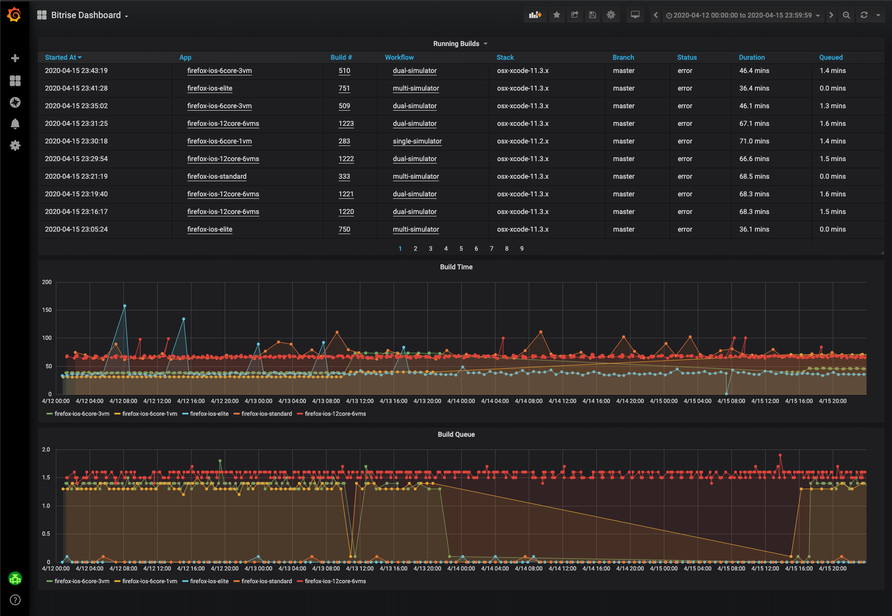
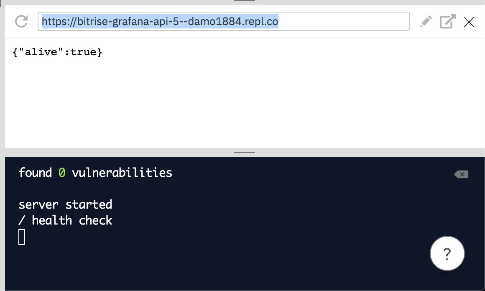
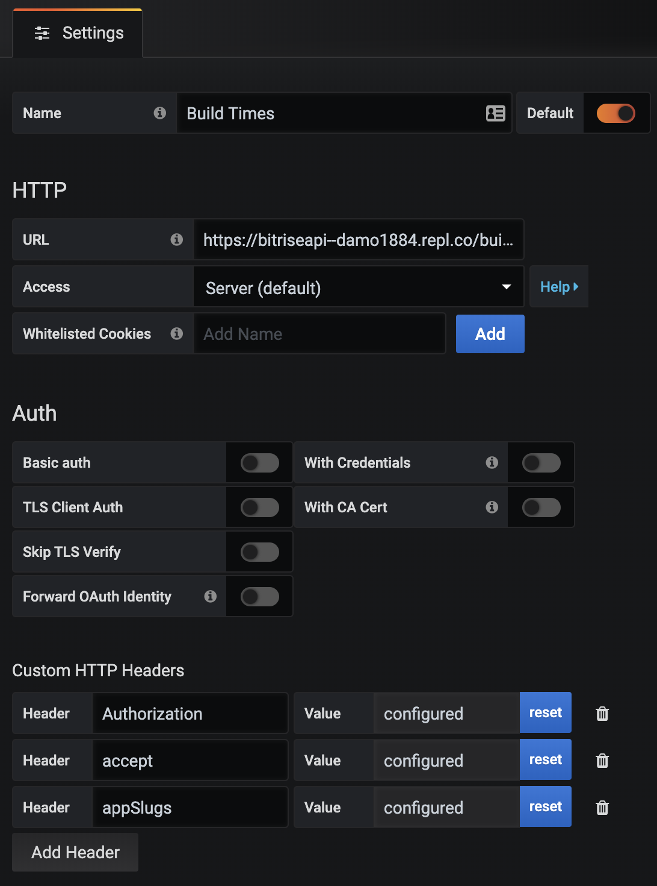
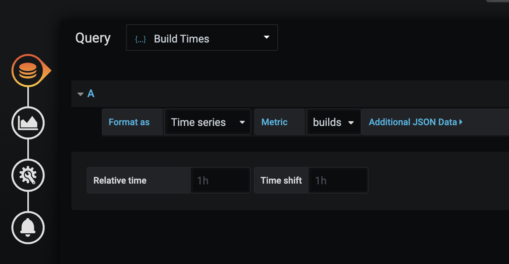

# bitrise-grafana-api

Grafana Wrapper for Bitrise API



# Run Locally

## Install Dependencies

```npm i```

## Running Grafana JSON Data Source

```node index.js```

# Run on Repl.it

[](https://repl.it/github/DamienBitrise/bitrise-grafana-api)

Just click the button above and when the Repl loads click Run.

Copy the base URL from the running Repl



## Two Grafana JSON Endpoints will be available

- /builds
- /queue

## Each endpoint will have the following APIs

- **/** should return 200 ok. Used for "Test connection" on the datasource config page.
- **/search** should return available metrics when invoked.
- **/query** should return metrics based on input.
- **/annotations** should return annotations.

## Install Grafana JSON Plugin

- https://grafana.com/grafana/plugins/simpod-json-datasource

## Generate Personal Access Token for Bitrise API

- https://devcenter.bitrise.io/api/authentication/#authentication

## Configure Grafana JSON Data Sources



Using the Base URL from your server or Repl configure two Grafana JSON Data Sources

### Builds

**URL:** BASE_URL/builds

**Headers**
- Authorization (Personal Access Token for Bitrise API)
- content ('application/json')
- appSlugs (comma seperated list of app slugs)

### Queue

**URL:** BASE_URL/queue

**Headers**
- Authorization (Personal Access Token for Bitrise API)
- content ('application/json')
- appSlugs (comma seperated list of app slugs)

## Configure Grafana JSON Dashboard


